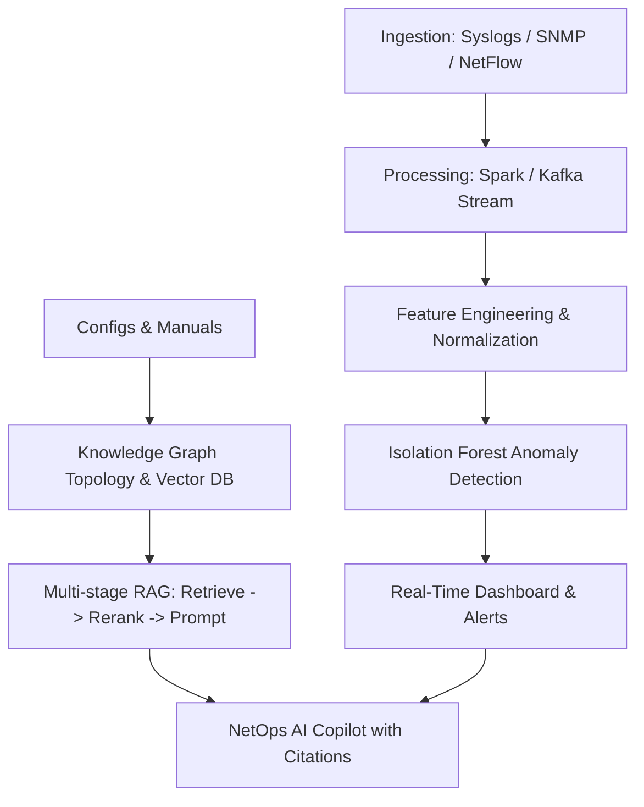

# Production Transformation Plan: Air-Gapped NetOps AI

This document outlines the architectural roadmap and tasks required to transform the current local NetOps AI MVP into a production-grade enterprise dashboard designed for secure, air-gapped deployments.

---

## 1. Architectural Goals

### Key Upgrades
1.  **AI Engine & RAG**: Move from naive vector search to **Hybrid Search** (Knowledge Graph + Vector DB) to understand network topology. Add **Multi-stage RAG** (retrieval, reranking, source citation).
2.  **Machine Learning**: Upgrade from static Random Forest to unsupervised **Isolation Forest / Autoencoders** to detect zero-day network anomalies without requiring label sets, incorporating feedback loops.
3.  **Observability & Monitoring**: Track model performance, token throughput, retrieval faithfulness, and local VRAM/system resource utilization.
4.  **Enterprise Security**: Implement strict local **Role-Based Access Control (RBAC)** for dashboard view and AI context retrieval.

---

## 2. Roadmap & GitHub Issues

We have structured the product backlog into five major tracks:

### Track 1: Multi-stage RAG & Precise Source Citations
*   **Goal**: Ensure the LLM outputs precise Cisco/Juniper commands backed by verified configurations and manuals, eliminating hallucinations.
*   **Tasks**: Integrate a local reranker (e.g., `bge-reranker-large`), split documents into semantic chunks with metadata, and display source citations in the chat interface.
*   **GitHub Issue**: [#1](https://github.com/harsh-pandhe/airgapped-netops-ai/issues/1)

### Track 2: Network Topology Knowledge Graph
*   **Goal**: Enable the LLM to understand how switches, routers, and firewalls are connected (network topology).
*   **Tasks**: Implement a light graph database layer (or graph network representation) and combine node connections with vector similarity search.
*   **GitHub Issue**: [#2](https://github.com/harsh-pandhe/airgapped-netops-ai/issues/2)

### Track 3: Unsupervised Telemetry Anomaly Detection
*   **Goal**: Detect network anomalies and concept drift without static labels.
*   **Tasks**: Implement an unsupervised Isolation Forest model, create a retraining pipeline triggered by manual feedback, and log SHAP explanation values.
*   **GitHub Issue**: [#3](https://github.com/harsh-pandhe/airgapped-netops-ai/issues/3)

### Track 4: Local Observability & System Monitoring Dashboard
*   **Goal**: Monitor the local infrastructure running the AI and telemetry pipeline.
*   **Tasks**: Expose metrics for GPU/VRAM usage, model inference speed, token usage rate, and vector database query times.
*   **GitHub Issue**: [#4](https://github.com/harsh-pandhe/airgapped-netops-ai/issues/4)

### Track 5: Access Control & Security Auditing
*   **Goal**: Prevent unauthorized configuration generation and access.
*   **Tasks**: Introduce JWT token authentication, map user roles to device access, and log all generated configurations in a tamper-proof audit trail.
*   **GitHub Issue**: [#5](https://github.com/harsh-pandhe/airgapped-netops-ai/issues/5)
